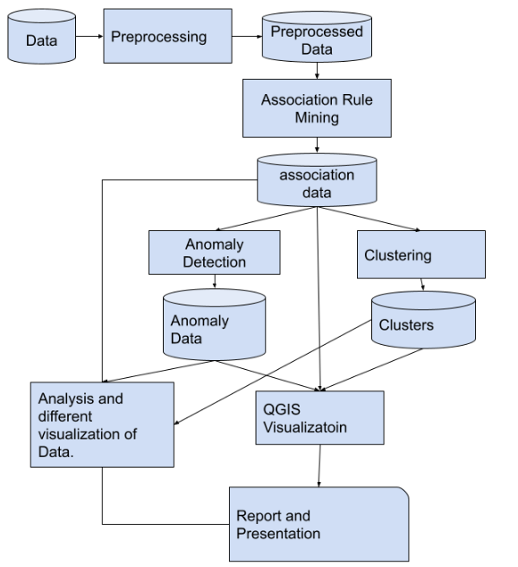

# Impact of development indicators on CO2 Emission

## Dependencies
- Python 3.8.10
    - requests 2.22.0, For importing data from world bank api
    - mlxtend 0.19.0, For association rule mining 

## Folder Structure
- *data* contains all the data files that are used as inputs
- *src* contains the python source code
- *config* contains any configuration related files.
- *output* contains the csv output files(this will include any charts or images)
- *scripts* contains shell scripts for individual modules
- *analysis* constains any analysis done. I may also contain python notebooks with visualizations
- *reports* contains the final report/presentation
- *temp* may contain any intermediate files generated which cannot be classified under input/output
- *run.sh* is the main shell file which will be used to execute the whole project.
- *docs* may contain any additional documentation.

## How to run
- Download data using [world bank api](https://datahelpdesk.worldbank.org/knowledgebase/articles/898581).
    - In config/indicators.csv specify the indicators to use by setting *selected* column to true. Specify the directory they go into using *type* column.
    - run the following shell script to download the data
    ``` 
    ./scripts/getIndicators.sh 
    ```
    - Note: make sure the script is executable if not, run the following command.
    ```
    chmod +x ./scripts/getIndicators.sh
    ``` 
 - Find correlation between two indicators
    - In config/features_for_correlation.csv add path of location of indicators files and their name. Also add output path with file_name.csv.
    - python file src/mainFeatureCorrelation.py is use to correlation for each indicators in the config file and save those in output/Correlation. Seprate csv file is genrated  for every entry in config file.
    - Run mainFeatureCorrelation.py to genrate correlation result. It is saved in output/Correlation/
    ```
    python3 ./src/mainFeatureCorrelation.py
    ```   
    - Code for findind correlation is in pearsonCorrelation.py in ./src. This file is used by mainFeatureCorrelation.py to calculate R and P_value for each entry in config file


## Links
- [task board](https://docs.google.com/spreadsheets/d/1r1YpixL6u7zpWadBuG9_rW5ifJSiyAsz3_3n8ZCSk0o/edit#gid=0)
- [description](https://docs.google.com/document/d/1mU4W2vZvq9CwpVhuHi2yr4_RRzJJw3zrdTS1ehp1rnE/edit)
- [world bank api](https://datahelpdesk.worldbank.org/knowledgebase/articles/898581)
- [Association Rule Mining - FP Growth](https://pyshark.com/market-basket-analysis-using-association-rule-mining-in-python/)

## Flow

